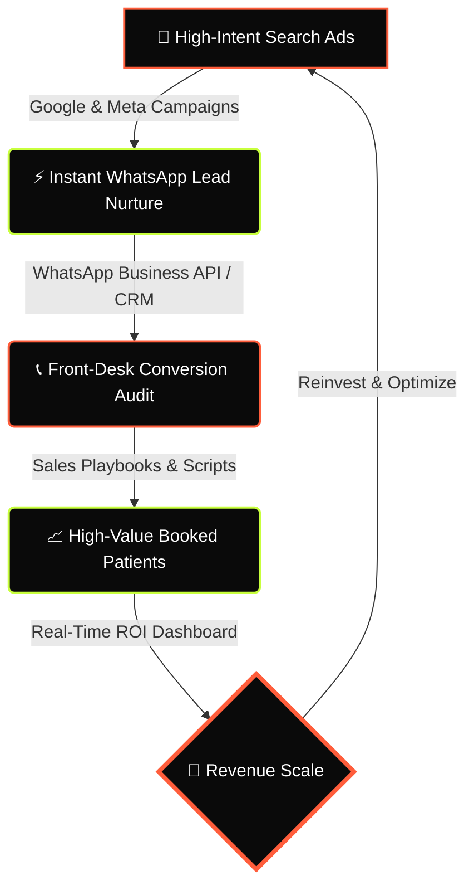

# <div align="center">⚖️ MedScale Systems</div>

<div align="center">
  
  **Healthcare's #1 Patient Acquisition & Growth Engine**

  [](https://github.com)
  [](https://vite.dev)
  [](https://react.dev)
  [](https://tailwindcss.com)
  [](https://netlify.com)

</div>

---

## <div align="center">🔄 The Patient Acquisition Engine</div>



---

## 👤 Executive Profile — Isaac Vivian (Founder)
> **"Business is less about intelligence and more about endurance. Most people never stay in the game long enough to discover what they’re truly capable of."**

Isaac Vivian is the Founder of **MedScale Systems**, a specialized growth advisory and technology partner for premium aesthetic and cosmetic healthcare clinics. MedScale builds comprehensive patient acquisition infrastructures that integrate performance marketing, CRM automation, and front-desk sales processes to deliver scalable, predictable revenue growth.

---

## 🛠️ The Architecture & Systems

### 01. Google & Meta Acquisition
Deploying performance marketing campaigns to capture prospective patients actively seeking aesthetic and cosmetic treatments.

### 02. CRM & Follow-up Automation
Integrating instant messaging auto-responses via WhatsApp Business API and custom CRM workflows to capture and nurture leads in under 5 minutes.

### 03. Front-Desk Sales Alignment
Auditing clinic booking scripts and training front-desk teams to maximize lead-to-consultation conversion rates.

### 04. Real-Time ROI Dashboards
Delivering complete visibility over customer acquisition costs (CAC), lifetime value (LTV), and marketing spend return.

---

## 🏆 Proven Results Delivered
| Metric | Achievement | Impact |
| :--- | :--- | :--- |
| **Qualified Leads** | **50+ Leads / Month** | Predictable booking pipeline |
| **Response Time** | **< 5 Minutes** | Instant patient engagement |
| **ROI** | **3.5x Average ROI** | Scalable practice growth |

---

## 🔒 Security & HIPAA Compliance
> [!IMPORTANT]
> **HIPAA-Compliant by Design**
> Every system, form, and database built by MedScale is encrypted in transit and at rest to protect sensitive patient records and Protected Health Information (PHI).

* **Encrypted Lead Captures**: Standard secure SSL/TLS protocols for landing page forms.
* **Server-Side Configurations**: Deployment profiles enforce strict clickjacking protection (`X-Frame-Options`), MIME protection, and HTTPS redirection.

---

## 💻 Tech Stack & Deployment

* **Frontend Framework**: React (TypeScript) + Vite
* **Styling Engine**: Tailwind CSS
* **Build Optimization**: `vite-plugin-singlefile` (Compiles all styles/scripts into a single, high-performance static HTML file)

### Getting Started

1. **Install Dependencies**:
   ```bash
   npm install
   ```
2. **Launch Dev Server**:
   ```bash
   npm run dev
   ```
3. **Build Production Asset**:
   ```bash
   npm run build
   ```

---

<div align="center">
  <sub>Developed by MedScale Systems © 2026. All rights reserved.</sub>
</div>
